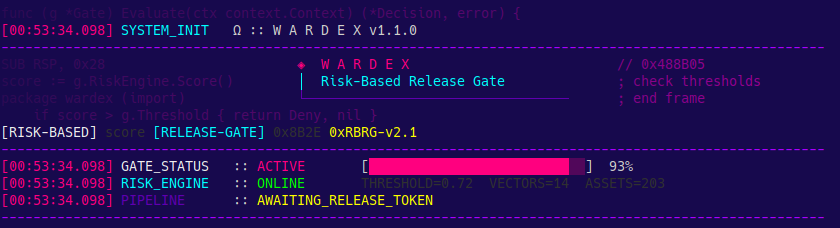

<div align="center">
  <h1>Wardex</h1>
  <p><b>Gap Analysis, Risk-Based Release Gate and Business Impact — CLI Tool & Engine in Go</b></p>

  [](https://github.com/had-nu/wardex)
  
  [](https://goreportcard.com/report/github.com/had-nu/wardex)
  
  
  [](https://www.gnu.org/licenses/agpl-3.0)
  [](https://github.com/had-nu/lazy.go)

  <br>
  <a href="README-en.md">English</a> | <a href="README-fr.md">Français</a> | <a href="README-es.md">Castellano</a> | <a href="README.md">Português</a>
  <br><br>

  
</div>

> [!IMPORTANT]
> **TeamPCP Attack Surface Motivation:** Following the "TeamPCP" campaign which weaponized security tools into attack vectors against diligent pipelines, Wardex has prioritized and accelerated its defensive hardening roadmap. Recent updates include SHA256 pinning for all Actions, strict workflow permission isolation, CDN integrity via SRI, and cryptographic provenance for all enrichment data. A full security post-mortem is forthcoming.


Wardex is a robust Command Line Interface (CLI) tool and Engine written in Go that ingests already implemented security controls in your organization and maps them against multiple global compliance frameworks, including the 93 controls of the ISO/IEC 27001:2022 standard (Annex A), SOC 2, NIS 2, and DORA.

Designed to be used both as a standalone CLI and as an embeddable SDK, Wardex acts as a **Risk-Based Release Gate** in your CI/CD pipelines. Instead of blocking software releases based on static binary metrics (like "CVSS > 7.0"), Wardex calculates the real release risk by adjusting technical vulnerability to business impact, infrastructure exposure, and existing compensating controls.

## Why Wardex?

Check the documentation in `/doc` to understand the architectural vision and the business problems the tool solves:
- [Business Vision (BUSINESS_VIEW.md)](doc/BUSINESS_VIEW.md)
- [Technical Architecture and Math (TECHNICAL_VIEW.md)](doc/TECHNICAL_VIEW.md)
- [Didactic Use Cases — 10 Complete Scenarios with Real Inputs & Outputs (USECASES.md)](doc/USECASES.md)

## Supported Frameworks (as of v1.5.0)

Wardex provides native mapping for the following compliance standards (via the `--framework` flag):
- **ISO/IEC 27001:2022** (`iso27001` - default)
- **SOC 2** (`soc2` - Trust Services Criteria)
- **NIS 2** (`nis2` - EU Directive 2022/2555)
- **DORA** (`dora` - Digital Operational Resilience Act)

## Build and Installation

Ensure you have [Go (>= 1.26)](https://go.dev/doc/install) installed.

### Option 1: Global Installation (Recommended)
You can install Wardex directly on your system, allowing you to run the `wardex` command anywhere:

```bash
go install github.com/had-nu/wardex@latest
```
*(Ensure the `$(go env GOPATH)/bin` directory is included in your `$PATH` or environment)*

### Option 2: Local Build from Source
If you prefer to clone the repository to test or develop locally:

```bash
git clone https://github.com/had-nu/wardex.git
cd wardex
make build
```

### Upgrading to Latest Release
When a new patch or minor version is released (e.g., `v1.1.1`), you can upgrade by fetching the latest code or tag and rebuilding:

```bash
# For global installations
go install github.com/had-nu/wardex@latest

# For local builds (e.g., targeting a specific tag)
git fetch --tags
git status
git checkout v1.7.1
make build
```

Please refer to the [CHANGELOG.md](CHANGELOG.md) for detailed release notes and patch information.

## What's New (v1.7.1)

- **Governance Commands (Automation Ready)**: New subcommands for complex workflows: `wardex evaluate` (focused gate check), `wardex aggregate` (composite multi-framework decision), and `wardex policy check-expiry` (audit of YAML policy exceptions).
- **Empirical Risk Calibration**: `Criticality` and `Exposure` parameters re-calibrated for Hospital (1.5), Startup (0.75), and Infrastructure (1.5) environments based on NVD/EPSS empirical analysis.
- **Human-in-the-Loop EPSS Enrichment (HITL)**: Failed evaluations due to missing EPSS vectors (where Wardex assumes a "fail-close" 1.0) can now be enriched via the FIRST.org API.
- **Strict Semantic Fail-Close**: The `0.05` fallback for unknown scores has been revoked to `0.0`. Without concrete data, Wardex assumes maximum risk.

## Usage

Wardex allows you to ingest policies in a simple YAML or JSON format, cross-reference vulnerabilities (e.g., Grype output) in a target file, and validate the gate:

```bash
./bin/wardex --config=test/testdata/wardex-config.yaml --gate=test/testdata/vulnerabilities.yaml test/testdata/dummy_controls.yaml
```

This generates visual reports (in Markdown, CSV, or JSON) exposing the Maturity Analysis of the 4 global areas of ISO 27001 (People, Processes, Technological, and Physical) and executes decision policies (ALLOW / BLOCK / WARN) depending on the organization's calibrated risk.

## GitHub Actions Integration (CI/CD)

Integrating **Wardex** into GitHub Actions transforms your pipeline into a real **Risk Governance** process. Wardex acts as a "Release Gate" immediately following your security scans.

Practical example:

```yaml
# .github/workflows/wardex-gate.yml
jobs:
  risk-governance:
    runs-on: ubuntu-latest
    steps:
      - uses: actions/checkout@v4
      
      # Secure Installation (v1.7.1)
      - name: Install Wardex
        run: |
          VERSION="v1.7.1"
          curl -sSL "https://github.com/had-nu/wardex/releases/download/${VERSION}/wardex_Linux_x86_64.tar.gz" | tar -xz
          sudo mv wardex /usr/local/bin/

      # Risk Evaluation
      - name: Evaluate Risk Gate
        run: |
          wardex --config ./doc/examples/wardex-config.yaml \
                 --gate ./evidence.json \
                 ./doc/examples/policy-nis2.yaml \
                 --fail-above 0.9
```

Check the example files to configure your pipeline:
- [CI/CD Configuration (wardex-config.yaml)](doc/examples/wardex-config.yaml)
- [Example NIS2/ISO27001 Policy (policy-nis2.yaml)](doc/examples/policy-nis2.yaml)

## SDK Usage

The **Wardex** architecture was designed with a strong separation of concerns (in the `pkg/` directory). This means that besides using the CLI, Wardex can be imported as a library SDK in any other Go project, such as a REST API, a GRC orchestration service, or a bot.

Example of programmatic submission for *Risk-Based Release Gate* evaluation:

```go
package main

import (
	"fmt"

	"github.com/had-nu/wardex/pkg/model"
	"github.com/had-nu/wardex/pkg/releasegate"
)

func main() {
	// Configure the organization and asset context
	gate := releasegate.Gate{
		AssetContext: model.AssetContext{
			Criticality:    0.9,
			InternetFacing: true,
			RequiresAuth:   true,
		},
		CompensatingControls: []model.CompensatingControl{
			{Type: "waf", Effectiveness: 0.35},
		},
		RiskAppetite: 6.0,
	}

	vulns := []model.Vulnerability{
		{CVEID: "CVE-2024-1234", CVSSBase: 9.1, EPSSScore: 0.84, Reachable: true},
	}

	// Evaluate compost risk directly within your code
	report := gate.Evaluate(vulns)

	fmt.Printf("The Gate decision for this release was: %s\n", report.OverallDecision)
}
```

## Exception Management and Risk Acceptance

When Wardex blocks a release for exceeding the allowable risk appetite, organizations can manage exceptions formally and audibility through the `wardex accept` subcommand:

```bash
# Request risk acceptance for a blocked vulnerability
wardex accept request --report report.json --cve CVE-2024-1234 --accepted-by sec-lead@company.com --justification "Risk mitigated by external controls" --expires 30d

# Verify the cryptographic integrity of all active acceptances
wardex accept verify
```

Wardex guarantees the integrity of these exceptions using HMAC-SHA256 signatures, append-only audit logs (`JSONL`), and configuration drift detection.

## Contextual Risk — Same CVE, 4 Decisions

Wardex calculates: `FinalRisk = (CVSS x EPSS) x (1 - Compensation) x Criticality x Exposure`

| CVE | CVSS | EPSS | [BANK] | [SAAS] | [INFRA] | [HOSP] |
|---|---|---|---|---|---|---|
| **Log4Shell** | 10.0 | 0.94 | **14.1** `BLOCK` | **3.5** `BLOCK` | **7.1** `BLOCK` | **11.3** `BLOCK` |
| **xz backdoor** | 10.0 | 0.86 | **12.9** `BLOCK` | **3.2** `BLOCK` | **6.5** `BLOCK` | **10.3** `BLOCK` |
| **curl SOCKS5** | 9.8 | 0.26 | **3.8** `BLOCK` | **1.0** `ALLOW` | **1.9** `BLOCK` | **3.1** `BLOCK` |
| **minimist** | 9.8 | 0.01 | **0.1** `ALLOW` | **0.0** `ALLOW` | **0.1** `ALLOW` | **0.1** `ALLOW` |

Validated with **237 real CVEs** and live EPSS scores from FIRST.org:

| Profile | Appetite | BLOCK | ALLOW | % Block |
|---|---|---|---|---|
| [BANK] Tier-1 Bank (DORA) | 0.5 | **176** | 57 | 74% |
| [HOSP] Hospital (HIPAA) | 0.8 | **168** | 63 | 71% |
| [SAAS] Startup SaaS | 2.0 | **111** | 86 | 47% |
| [INFRA] Utilities (NIS2) | 0.3 | **180** | 53 | 76% |

Full report: [EPSS Multi-Context Stress Test Report](doc/epss-stress-test-report.md)

## Local Policy Management

Wardex enables granular management of compliance policies by framework and domain (e.g., ISO 27001) using a simple, validatable YAML schema. Instead of manually creating or editing large files, you can use the `policy` subcommand to safely manipulate controls via automation:

```bash
# Validates all domain YAML files, ensuring the schema remains unbroken
wardex policy validate frameworks/iso27001/

# Lists the compliance status of all controls in a readable tabular format
wardex policy list frameworks/iso27001/

# Safely upserts a single control entry without breaking manual YAML syntax
wardex policy add \
  --file frameworks/iso27001/technological_controls.yml \
  --id A.8.5 \
  --title "Secure authentication" \
  --status partial \
  --owner "Security Team" \
  --note "MFA enforced; hardware tokens pending rollout"
```

This ensures policy files map structurally to the expected `wardex` schema, simplifying audit requests and native repo integration for pure Governance-as-Code.

---
<div align="center">
  <a href="https://github.com/had-nu/lazy.go"></a>
</div>
