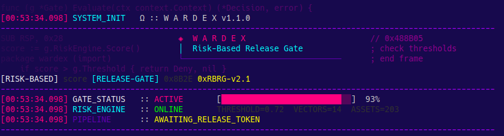

<div align="center">
  <h1>Wardex</h1>
  <p><b>Gap Analysis, Risk-Based Release Gate e Business Impact — CLI Tool & Engine em Go</b></p>

  [](https://github.com/had-nu/wardex)
  
  [](https://goreportcard.com/report/github.com/had-nu/wardex)
  
  [](https://www.gnu.org/licenses/agpl-3.0)
  [](https://github.com/had-nu/lazy.go)
  <br>
  <a href="README-en.md">English</a> | <a href="README-fr.md">Français</a> | <a href="README-es.md">Castellano</a> | <a href="README.md">Português</a>
  <br><br>

  
</div>


Wardex é uma ferramenta de linha de comando (CLI) escrita em Go que ingere controlos de segurança já implementados na sua organização e os mapeia contra os 93 controlos da norma ISO/IEC 27001:2022 (Annex A).

Mais do que uma simples ferramenta de conformidade, o Wardex atua como um **Risk-Based Release Gate** nas suas pipelines de CI/CD. Em vez de bloquear lançamentos de software baseando-se em métricas binárias e estáticas (como "CVSS > 7.0"), o Wardex calcula o risco de lançamento real, ajustando a vulnerabilidade técnica ao impacto no negócio, exposição da infraestrutura, e controlos de compensação existentes.

## Porquê o Wardex?

Consulte a documentação em `/doc` para compreender a visão arquitetónica e os problemas de negócio que a ferramenta resolve:
- [A Visão de Negócio (BUSINESS_VIEW.md)](doc/BUSINESS_VIEW.md)
- [Arquitetura e Matemática Técnica (TECHNICAL_VIEW.md)](doc/TECHNICAL_VIEW.md)

## Compilação e Instalação

Assegure que tem o [Go (>= 1.21)](https://go.dev/doc/install) instalado.

### Opção 1: Instalação Global (Recomendado)
Pode instalar o Wardex diretamente no seu sistema, permitindo executar o comando `wardex` em qualquer lugar:

```bash
go install github.com/had-nu/wardex@latest
```
*(Certifique-se que o diretório `$(go env GOPATH)/bin` está incluído no seu `$PATH` ou ambiente)*

### Opção 2: Compilação Local a partir do Código-Fonte
Se preferir clonar o repositório para testar ou desenvolver localmente:

```bash
git clone https://github.com/had-nu/wardex.git
cd wardex
go build -o wardex .
```

### Atualização para a Versão Mais Recente
Quando um novo patch ou versão minor for lançado (ex: `v1.1.1`), pode atualizar obtendo o código ou a tag mais recente e reconstruindo o binário:

```bash
# Para instalações globais
go install github.com/had-nu/wardex@latest

# Para builds locais (ex: escolher uma tag específica)
git fetch --tags
git checkout v1.1.1
go build -o wardex .
```

Por favor, consulte o [CHANGELOG.md](CHANGELOG.md) para detalhes sobre as notas de lançamento e correções de bugs.

## Como Usar

O Wardex permite ingerir as políticas num formato simples YAML ou JSON, cruzar as vulnerabilidades (ex: output do Grype ou SBOMs) num ficheiro alvo, e validar o gate:

```bash
./bin/wardex --config=test/testdata/wardex-config.yaml --profile=minha-equipa --gate=test/testdata/vulnerabilities.yaml test/testdata/dummy_controls.yaml
```

Isto gera relatórios visuais (em Markdown, CSV ou JSON) expondo a Análise de Maturidade das 4 áreas globais da ISO 27001 (Pessoas, Processos, Tecnológico e Físico) e executa as políticas de decisão (ALLOW / BLOCK / WARN) consoante o risco calibrado da organização.

## Novidades (v1.3.0)

- **Ingestão Nativa de SBOMs (`wardex convert sbom`)**: O Wardex agora ingere e converte faturamentos de software padrão como CycloneDX JSON e SPDX nativamente, lendo o CVSS e componentes de forma agnóstica para análise de segurança na pipeline sem depender de parsers externos.
- **Perfis de Controlo de Acesso (RBAC) `--profile`**: Os limites de apetite de risco já não precisam ser hardcoded no ficheiro de configuração raiz. Através dos blocos de `profiles:` globais, é possível executar avaliações baseadas em pipeline invocando uma equipa dinamicamente (`--profile admin`, `--profile frontend`).
- **Assinaturas e Auditoria Criptográfica HMAC-SHA256**: O subsistema de *Risk Acceptances* agora funciona como um sistema append-only garantido por primitivas criptográficas que defendem contra *tampering*, violações de tempo de expiração e *side-channel attacks*.

## Novidades (v1.2.0)

- **Simulador de Risco Interativo (`wardex simulate`)**: Utilize o comando `simulate` para gerar e abrir um dashboard web interativo offline que permite testar em tempo real como o CVSS, o EPSS, e os controlos de compensação afetam a pontuação de risco da sua organização.
- **Conversor Grype (`wardex convert grype`)**: Converta facilmente a saída JSON do verificador de vulnerabilidades Grype para o formato YAML nativo do Wardex, ideal para integração imediata em pipelines CI/CD.
- **Banda de Risco Moderado (`warn_above`)**: Permite aprovar lançamentos mas emitir avisos detalhados quando o risco excede um limite inferior seguro mas ainda não ultrapassa o apetite de risco fatal da organização.

## Utilização como Biblioteca (SDK)

A arquitetura do **Wardex** foi desenhada com forte separação de responsabilidades (no diretório `pkg/`). Isto significa que além de utilizar o CLI, o Wardex pode ser importado como uma biblioteca (library) em qualquer outro projeto Go, como uma API REST, um serviço de orquestração GRC ou um bot.

Exemplo de submissão programática para avaliação por *Risk-Based Release Gate*:

```go
package main

import (
	"fmt"

	"github.com/had-nu/wardex/pkg/model"
	"github.com/had-nu/wardex/pkg/releasegate"
)

func main() {
	// Configure o contexto da organização e do ativo
	gate := releasegate.Gate{
		AssetContext: model.AssetContext{
			Criticality:    0.9,
			InternetFacing: true,
			RequiresAuth:   true,
		},
		CompensatingControls: []model.CompensatingControl{
			{Type: "waf", Effectiveness: 0.35},
		},
		RiskAppetite: 6.0,
	}

	vulns := []model.Vulnerability{
		{CVEID: "CVE-2024-1234", CVSSBase: 9.1, EPSSScore: 0.84, Reachable: true},
	}

	// Avalia o risco composto diretamente dentro do seu código
	report := gate.Evaluate(vulns)

	fmt.Printf("A decisão do Gate para este lançamento foi: %s\n", report.OverallDecision)
}
```

## Gestão de Exceções e Aceitação de Risco

Quando o Wardex bloqueia um lançamento por exceder o apetite de risco admissível, as organizações podem gerir exceções de forma formal e auditável através do subcomando `wardex accept`:

```bash
# Solicitar a aceitação de risco para uma vulnerabilidade bloqueada
wardex accept request --report report.json --cve CVE-2024-1234 --accepted-by sec-lead@company.com --justification "Risco mitigado por controlos externos" --expires 30d

# Verificar a integridade criptográfica de todas as aceitações ativas
wardex accept verify
```

O Wardex garante a integridade destas exceções utilizando assinaturas HMAC-SHA256, logs de auditoria append-only (`JSONL`) e deteção de alterações indesejadas na configuração (drift).

---
