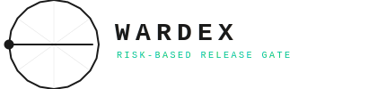

<div align="center">



[](https://go.dev/)
[](https://goreportcard.com/report/github.com/had-nu/wardex)
[](https://github.com/had-nu/wardex/actions/workflows/ci.yml)
[](#licenciamento)

<br>
<a href="README-en.md">English</a> | <a href="README.md">Português</a>
<br><br>

</div>

> [!IMPORTANT]
> **Supply chain hardening (TeamPCP):** Na sequência da campanha TeamPCP — que usou ferramentas de segurança como vectores de ataque em pipelines CI/CD — o Wardex antecipou o seu roadmap defensivo. As acções do GitHub usam SHA256 pinning, os workflows têm permissões mínimas declaradas explicitamente, e os payloads de enriquecimento EPSS são assinados criptograficamente antes de entrar na pipeline.

---

O **Wardex** é uma CLI e biblioteca Go com dois propósitos distintos:

1. **Release gate baseado em risco** — avalia vulnerabilidades no contexto do activo (CVSS × EPSS × criticidade × exposição × controlos compensatórios) e decide ALLOW, WARN ou BLOCK. Substitui o threshold CVSS estático.

2. **Análise de gaps de conformidade** — cruza os controlos documentados pelo infosec com os controlos operacionais confirmados, e compara ambos com o catálogo do framework. Identifica o que é cobertura real, o que existe só em papel (*paper security*), e o que opera sem política (*shadow security*).

Os dois modos são independentes. Podes usar só um deles.

---

## Frameworks suportados

ISO/IEC 27001:2022 · SOC 2 · NIS 2 · DORA

```bash
wardex assess controls.yaml --framework iso27001  # predefinição
wardex assess controls.yaml --framework nis2
wardex assess controls.yaml --framework dora
```

---

## Instalação

```bash
go install github.com/had-nu/wardex@v1.9.0
```

Requer Go ≥ 1.26. Confirma que `$(go env GOPATH)/bin` está no teu `$PATH`.

Para compilar a partir do código-fonte:

```bash
git clone https://github.com/had-nu/wardex.git
cd wardex && make build
```

---

## Análise de gaps de conformidade

O Wardex compara o que o infosec declarou com o que está operacionalmente activo, e identifica o delta em relação ao framework.

### Input

Dois ficheiros YAML com o campo `layer` a identificar a origem:

```yaml
# documented-controls.yaml — políticas declaradas pelo infosec
- id: CTRL-IAM-001
  name: Multi-Factor Authentication
  layer: documented
  domains: [access_control]
  maturity: 4
  evidences:
    - type: policy
      ref: https://wiki.internal/sec/mfa-policy

# implemented-controls.yaml — controlos operacionais confirmados
# (produzido por Bridgr ou mantido manualmente)
- id: CTRL-IAM-001
  name: Multi-Factor Authentication
  layer: implemented
  domains: [access_control]
  maturity: 4
  effectiveness: 0.90
  evidences:
    - type: tool
      ref: okta-mfa-config-2026
```

O mesmo ID em ambos os ficheiros é o caso esperado: controlo declarado e confirmado operacional. IDs presentes apenas num dos ficheiros são o sinal que interessa.

### Execução

```bash
wardex assess documented-controls.yaml implemented-controls.yaml \
  --framework iso27001 \
  -o markdown
```

### O que o report produz

O report separa os resultados em quatro estados de conformidade:

| Categoria | Significado |
|---|---|
| **Coberto** | Presente no layer `implemented`, maturidade >= 3 e com evidências operacionais. |
| **Paper security** | Documentado apenas. Sem controlo implementado correspondente. (Policy Gap) |
| **Shadow security** | Implementado mas sem política documentada. |
| **Gap** | Ausente em ambos os layers para um controlo do catálogo. |

A secção `LayerDelta` identifica o desvio real entre a intenção (política) e a execução (código), expondo a "ilusão de conformidade".

### Com activos

Se o teu inventário de activos estiver declarado, o report produz uma tabela de conformidade por activo:

```bash
wardex assess documented-controls.yaml implemented-controls.yaml \
  --assets assets.yaml \
  --framework iso27001 \
  -o json --out-file posture.json
```

```yaml
# assets.yaml — v1.8.0 Schema
- id: ASSET-PAY-001
  name: Payment API
  type: application
  criticality: 0.9
  scope: [iso27001]
  controls: [CTRL-IAM-001, CTRL-CRYPTO-002]
  exposure:
    internet_facing: true
    network_zone: dmz
    data_classification: restricted
  threats:
    - id: T-01
      scenario: "API abuse"
      likelihood: high
  owner: platform-team
```

---

## Release gate baseado em risco

O gate avalia vulnerabilidades com o modelo:

```
R(v, α) = (CVSS(v)/10) × EPSS(v) × C(α) × E(α) × (1 − Φ(α))
```

CVSS é dividido por 10 para normalizar a escala: o produto `(CVSS/10) × EPSS` fica em [0, 1], e o output final `R` em [0, 1.5]. Os thresholds em `wardex-config.yaml` (`risk_appetite`, `warn_above`) vivem nessa mesma escala.

`C` é a criticidade do activo, `E` é a exposição efectiva, e `Φ` é a eficácia dos controlos compensatórios (clamped em 0.80 — máximo 80% de redução, `1 − Φ` mínimo de 0.20).

O resultado é comparado com o `risk_appetite` definido em `wardex-config.yaml`. Três bandas possíveis: `ALLOW`, `WARN`, `BLOCK`.

### Configuração

```yaml
# wardex-config.yaml
release_gate:
  enabled: true
  risk_appetite: 0.20
  warn_above: 0.12
  mode: any               # "any" bloqueia se qualquer vuln exceder; "aggregate" usa soma
  asset_context:
    criticality: 0.8
    internet_facing: true
    requires_auth: true
  compensating_controls:
    - type: waf
      effectiveness: 0.35
```

### A mesma CVE, quatro contextos

O que diferencia o ALLOW do BLOCK não é a CVE — é o contexto do activo.

| CVE | CVSS | EPSS | [BANK] | [SAAS] | [INFRA] | [HOSP] |
|---|---|---|---|---|---|---|
| Log4Shell | 10.0 | 0.94 | **1.41** `BLOCK` | **0.75** `BLOCK` | **1.41** `BLOCK` | **1.13** `BLOCK` |
| xz backdoor | 10.0 | 0.86 | **1.29** `BLOCK` | **0.69** `BLOCK` | **1.29** `BLOCK` | **1.03** `BLOCK` |
| curl SOCKS5 | 9.8 | 0.26 | **0.38** `BLOCK` | **0.20** `WARN` | **0.38** `BLOCK` | **0.31** `BLOCK` |
| minimist | 9.8 | 0.01 | **0.01** `ALLOW` | **0.01** `ALLOW` | **0.01** `ALLOW` | **0.01** `ALLOW` |

*R ∈ [0, 1.5]. Thresholds por perfil na escala normalizada — ver `data/calibration.json`.*

Calibrado contra 237 CVEs reais com EPSS da FIRST.org (`data/dataset_2025-03-01.json`):

| Perfil | Apetite | BLOCK | ALLOW | % Block |
|---|---|---|---|---|
| Banco Tier-1 (DORA) | 0.5 | 176 | 57 | 74% |
| Hospital (HIPAA) | 0.8 | 168 | 63 | 71% |
| Startup SaaS | 2.0 | 111 | 86 | 47% |
| Energia/Águas (NIS2) | 0.3 | 180 | 53 | 76% |

### Enriquecimento EPSS

Quando o scanner não inclui EPSS, o Wardex assume EPSS 1.0 (pior caso) e bloqueia até validação explícita:

```bash
wardex enrich epss wardex-vulns.yaml --output epss-enrich.yaml
wardex evaluate --epss-enrichment epss-enrich.yaml --gate vulns.yaml controls.yaml
```

O enriquecimento consulta `api.first.org` e assina o resultado via HMAC-SHA256.

### Conversão de formatos

```bash
wardex convert grype results.json > vulns.yaml
wardex convert sbom sbom.xml > vulns.yaml
```

### Integração CI/CD

```yaml
# .github/workflows/wardex-gate.yml
jobs:
  risk-gate:
    runs-on: ubuntu-latest
    steps:
      - uses: actions/checkout@v4

      - name: Install Wardex
        run: go install github.com/had-nu/wardex@v1.9.0

      - name: Evaluate risk gate
        run: |
          wardex evaluate \
            --config .wardex/config.yaml \
            --gate vulns.yaml \
            controls.yaml
        # Exit 0 = ALLOW, Exit 10 = BLOCK, Exit 11 = compliance gap
```

---

## Aceitação de risco

Quando o gate bloqueia e existe um caso de negócio para prosseguir, o Wardex formaliza a excepção com dono nomeado, justificação e TTL. Expirações silenciosas e drift de configuração são detectados automaticamente.

```bash
# Solicitar aceitação
wardex accept request \
  --report report.json \
  --cve CVE-2024-1234 \
  --accepted-by sec-lead@company.com \
  --justification "WAF mitiga o vector de exploração; patch previsto para Q3" \
  --expiry 90d

# Verificar integridade de todas as aceitações activas
wardex accept verify

# Listar aceitações e estado
wardex accept list --active
```

As aceitações são assinadas com HMAC-SHA256 e registadas em log append-only (JSONL). O Wardex rejeita aceitações expiradas, adulteradas, ou cujo `wardex-config.yaml` sofreu drift desde a assinatura.

---

## Governação: Trust Store & Sealed Config (WexState)

Para conformidade **DORA** e cadeias de custódia não-repudiáveis, o Wardex permite selar as políticas de risco (`wardex-config.yaml`) num envelope criptográfico assinado (`.wexstate`).

*   **Identidade forte**: Baseado em chaves Ed25519 para Admins, CISOs e Analistas.
*   **Sealed Config**: Impede que políticas de risco sejam alteradas em CI/CD sem aprovação executiva.
*   **Trust Store Append-Only**: Registo central de chaves autorizadas e revogações.

```bash
# Sela a política (acção do CISO)
wardex config seal --keyring ciso.wex --input config.yaml --out config.wexstate

# Avalia com verificação obrigatória do selo
wardex evaluate --config config.wexstate --evidence vulns.yaml --strict
```

Consulte o [Playbook de Governação](doc/operations/WARDEX_TRUST_PLAYBOOK.md) para o fluxo completo.

---

## SDK

```go
import "github.com/had-nu/wardex/pkg/sdk"

controls, _ := sdk.LoadControls("./controls.yaml")
result, _   := sdk.Analyze(controls, "iso27001")

fmt.Printf("Coverage: %.1f%%\n", result.Summary.GlobalCoverage)
```

Para o release gate:

```go
import (
    "github.com/had-nu/wardex/pkg/model"
    "github.com/had-nu/wardex/pkg/releasegate"
)

gate := releasegate.Gate{
    AssetContext: model.AssetContext{
        Criticality:    0.9,
        InternetFacing: true,
        RequiresAuth:   true,
    },
    CompensatingControls: []model.CompensatingControl{
        {Type: "waf", Effectiveness: 0.35},
    },
    RiskAppetite: 6.0,
}

report := gate.Evaluate([]model.Vulnerability{
    {CVEID: "CVE-2024-1234", CVSSBase: 9.1, EPSSScore: 0.84, Reachable: true},
})

fmt.Println(report.OverallDecision) // ALLOW | WARN | BLOCK
```

---

## Documentação

- [Arquitectura e funcionamento interno](doc/TECHNICAL_VIEW.md)
- [Contexto de negócio e o problema do gate binário](doc/BUSINESS_VIEW.md)
- [Playbook — casos de uso com comandos completos](doc/WARDEX_PLAYBOOK.md)
- [Governação — Trust Store & Sealed Config Playbook](doc/operations/WARDEX_TRUST_PLAYBOOK.md)
- [Integração com GitHub Actions](doc/github-actions-integration.md)
- [Exit codes](internal/doc/EXIT_CODES.md)
- [CHANGELOG](CHANGELOG.md)

---

## Licenciamento

Duplo licenciamento:

**AGPL-3.0 (gratuito):** uso em pipelines CI/CD internas ou em projectos open-source que disponibilizem o código-fonte.

**Licença comercial (pago):** integração em produtos proprietários, plataformas SaaS, ou distribuição sem abertura do código-fonte. Consulta os [Termos Comerciais](doc/COMMERCIAL_LICENSE.md) ou contacta **andre_ataide@proton.me**.
